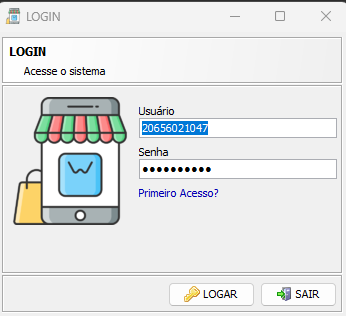
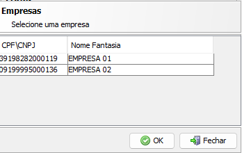
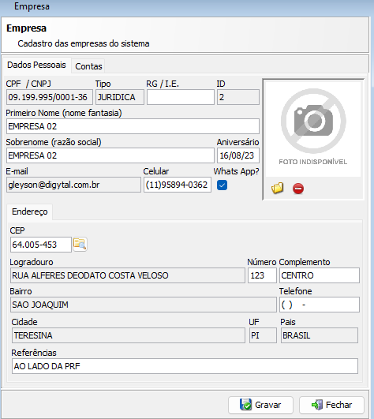
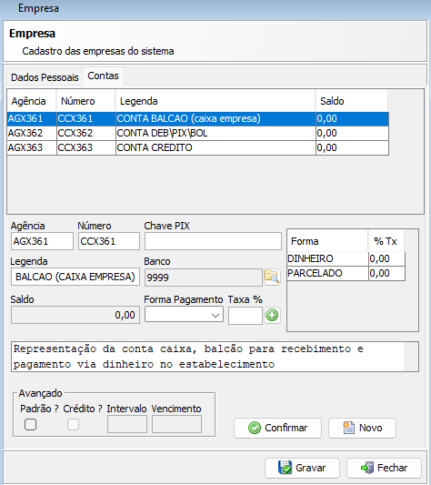
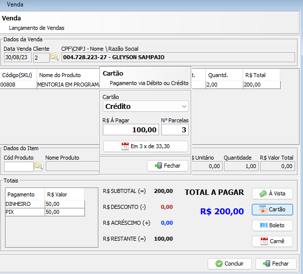
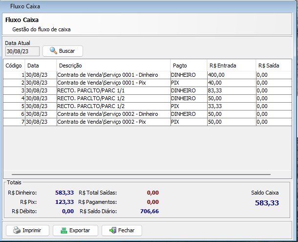
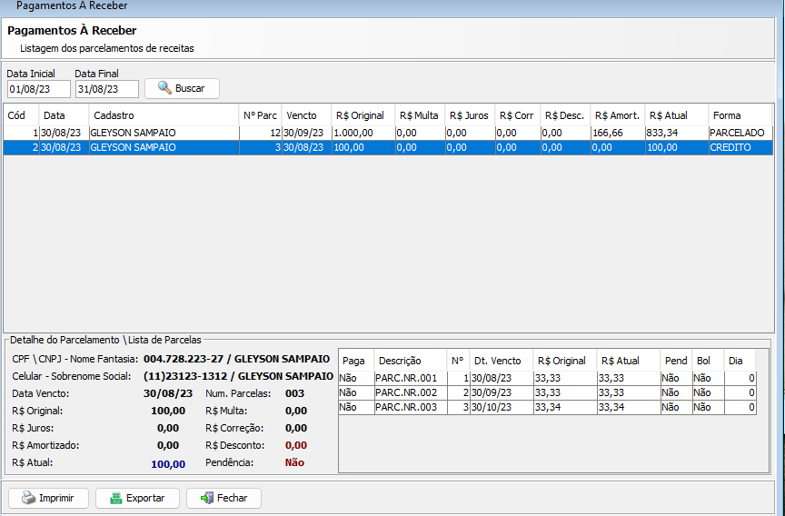

# Digytal - Programação, Pesquisa e Educação
[www.digytal.com.br](http://www.digytal.com.br)

[(11) 95894-0362](https://api.whatsapp.com/send?phone=5511958940362)

#### Autores
- [Gleyson Sampaio](https://github.com/glysns)
- [Frank Marlon](https://github.com/fmarlon)

# Control Desktop
Repositório do projeto Control Desktop

### Tecnologias

* Java 1.8+
* SpringBoot 2.7.4
* RestTemplate

### Executando a aplicação

Para executar a aplicação é simples, basta abrir a classe `ControlDesktopApplication` e ativar  `run` ou `debug` em sua IDE.

Confirme a url da api back-end em resources `application.properties`

### Telas

##### Login

##### Lista empresas

##### Configuração empresa

##### Configuração empresa conta

##### Venda

##### Caixa

##### Parcelas

